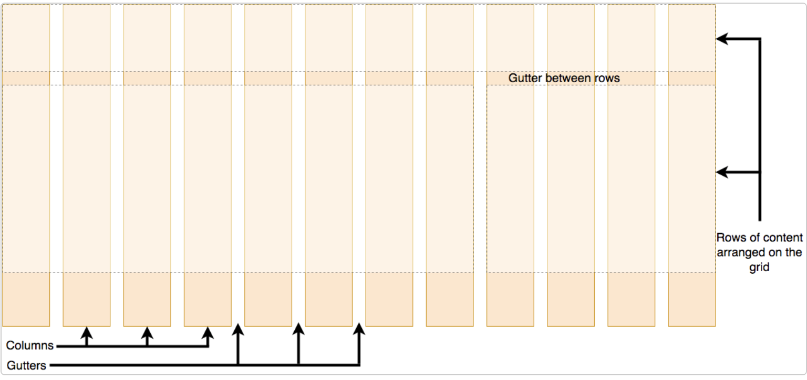

# Grid Lyaout Docs

[CSS_layout Dcos](https://developer.mozilla.org/en-US/docs/Learn/CSS/CSS_layout/Grids#the_minmax_function)

[CSS_layout Dcos](https://developer.mozilla.org/en-US/docs/Web/CSS/CSS_grid_layout/Grid_template_areas)

[CSS_layout Dcos](https://developer.mozilla.org/en-US/docs/Web/CSS/CSS_grid_layout)

[CSS_layout Dcos](https://www.w3schools.com/css/css_grid.asp)

## What is Grid?

**CSS grid layout is a two-dimensional layout system for the web. It lets you organize content into rows and columns and offers many features to simplify the creation of complex layouts.**
 

## What is grid layout? 

**A grid is a collection of horizontal and vertical lines creating a pattern against which we can line up our design elements. They help us to create layouts in which our elements won't jump around or change width as we move from page to page, providing greater consistency on our websites.**

**A grid will typically have columns, rows, and then gaps between each row and column. The gaps are commonly referred to as gutters.**

## CSS Grid Container Property

* display
* grid-auto-flow
* grid-template-columns
* grid-template-rows
* grid-auto-columns
* grid-auto-rows
* column-gap
* row-gap
* gap

<!-- CSS Grid Alignment Property -->

* justify-content
* justify-items
* align-content
* align-items

## CSS Grid Item Property

* grid-row-start
* grid-column-start
* grid-row-end
* grid-column-end
* grid-row (sort = start/end)
* grid-column (sort = start/end)
* grid-area (sort = row start/column start/ row end/ column end)

<!-- CSS Grid Alignment Property -->

* justify-self
* align-self

## CSS Grid Functions

* repeat()
* minmax()
* min-content
* max-content
* auto-fit
* auto-fill 

## Topics Of Grid 

- Defining a grid
- Flexible grids with the fr unit
- Gaps between tracks
- Repeating track listings
- Implicit and explicit grids
- Line-based placement
- The minmax() function
- As many columns as will fit
- Positioning with grid-template-areas
- Nesting grids and subgrid
- Grid frameworks